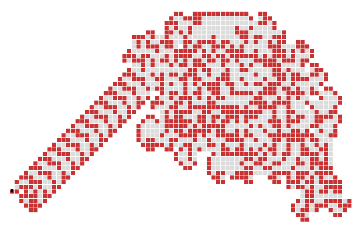
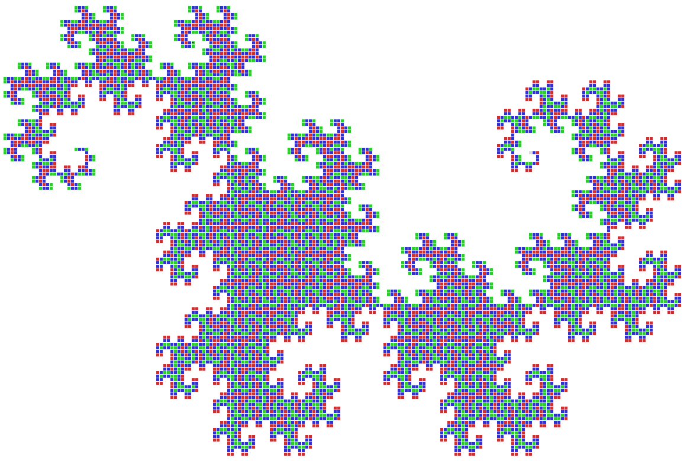
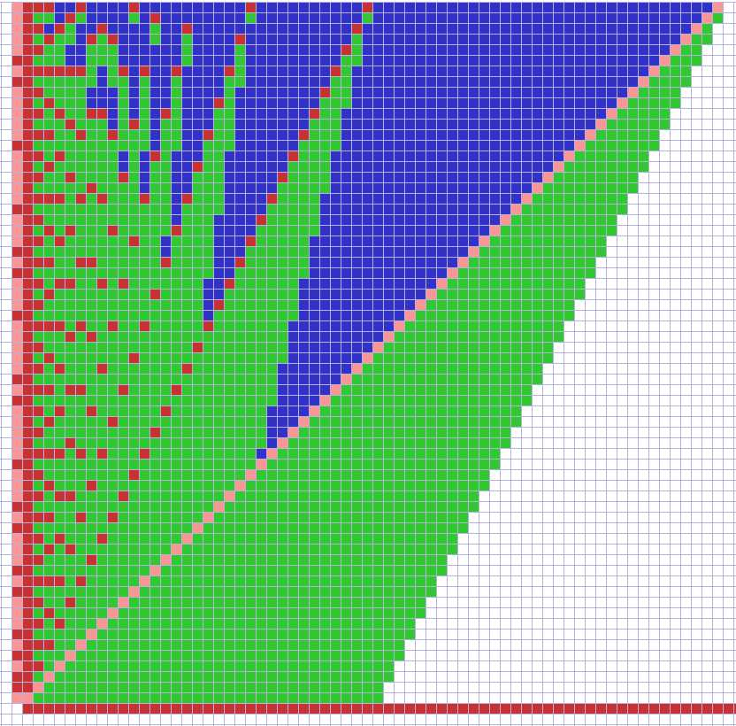
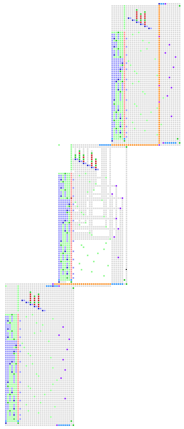

# Vants and Turmites

Vants and Turmites are 2D versions of Turing machines. They make patterns on a 2D square grid based on simple rules.

This repository contains the code that created the figures and animation for my Artificial Life paper on the topic. The repository also contains the video that was created to accompany the paper. The paper was recently accepted by the journal, so I anticipate the paper will be published in late 2025 or in 2026.

- Greg Turk

## Paper Abstract

The two-dimensional Turing machine is a promising but under-used simulation tool for Artificial Life. Single-state 2D Turing machines exhibit a variety of interesting behaviors, some of which have already been explored. Multi-state 2D Turing machines, despite their potential for simulating even more diverse behaviors, have received little attention to date. We demonstrate the potential of such automata for studying biological phenomena by showing how they can be used to simulate self-similar growth, the spread of disease, and self-reproduction. Some of the results presented here are from investigations that were performed around the time of [Dewdney 1989], but they have not been published until now.

## Video for Paper

In order to watch the accompanying video for the paper, download the MP4 file and play it locally on your computer.  The file is 16 MB in size.

[The turmite video (MP4)](media/turmite_movie.mp4)

## Figures of Some Vant and Turmite Patterns

Langton's Original Vant

Dragon Curve

Prime Number Sieve

Self-Reproduction

## How to Run the Code

This code is written in Processing / Java. The code was written for myself, and as such it has a fairly poor user interface (keyboard commands only).

1. Open `turmites/turmites.pde` in the [Processing IDE](https://processing.org/).
2. Press the  **Run** button.  This should show you the help screen.
3. Press any key to exit help.  Then press the space bar to see Langton's original Vant.

## Project Updates Will Be Infrequent

I don't plan to update this code very often. I apologize in advance if I don't respond to issues and pull requests.

## License

This project is licensed under the [MIT License](LICENSE).

